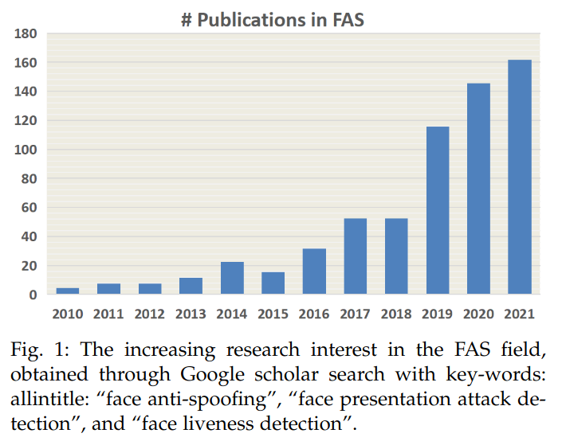

# タイトル
「他人のマイナ保険証でなりすまし」が可能な理由とは？

# このコラムで話題とする新聞記事

他人のマイナ保険証　顔写真かぶったら使えた…「なりすましできてしまう」医師懸念【実験動画】2023年8月2日 20時01分 
https://www.tokyo-np.co.jp/article/267398

上記リンク先の新聞記事を、下記に要約します。
> ChatGPTによる記事要約
> 
> この記事は、長崎市の内科医院院長が自分の顔写真を模したお面を女性スタッフにかぶらせ、自分のマイナ保険証を使って顔認証を試みたところ、問題なく認証されてしまったという内容です。
> 
> この結果により、顔認証システムの精度に疑問が投げかけられています。
> 
> この顔認証を行った読み取り機は「Caora」という機種で、PFU社が製造し、富士通Japanが販売しています。この機種の操作マニュアルには、「AI偽造検知」というなりすまし防止機能が記載されていますが、それでもなりすましを完全に防止できない場合があると明記されています。
> 
> 政府はマイナ保険証の導入理由として不正利用の防止を挙げていますが、この結果を受けて、その効果について疑問が投げかけられています。

<iframe width="560" height="315" src="https://www.youtube.com/embed/9y8PNrTRqcU" title="YouTube video player" frameborder="0" allow="accelerometer; autoplay; clipboard-write; encrypted-media; gyroscope; picture-in-picture; web-share" allowfullscreen></iframe>

# この新聞記事に対して、反論する記事
記事の翌日には、ITmedia NEWSから、反論記事が出ています。

「マイナ保険証の確認をお面で突破」記事が笑われるワケ　「あなたは誰？」の仕組みを解説
https://www.itmedia.co.jp/news/articles/2308/03/news174.html

上記リンク先の記事の一部を、下記に引用します。

> しかし、この機能はメーカーも説明しているように「簡易なりすまし抑制機能」であり、もともとなりすましを完全に防ぐ機能ではない。
> 目的はあくまでなりすましを抑制することだ。完璧に防げなくても、減らせれば役割は達成したといえる。病院でこれまでもやってきた目視での確認に、機械を使った抑制機能がプラスされると考えれば、少なくともデメリットとはいえない。
> 　そもそもカードリーダーは受付カウンターなどに設置することを想定した機器。たとえお面で突破できたとして、お面をかぶった人間を受付スタッフが見逃すだろうか。もしそれがあり得るなら病院側の体制の問題ではないか。

これは問題だと思います。

# なにが問題なのか？

ITmedia NEWSの記事によれば、「なりすましが出来ること」が前提になっており、顔認証しているのに、**病院受付の「目視」が絶対条件**になっています。これでは、最初から「目視」だけでよく、顔認証機能はいらないと思います。むしろ2度手間になっているし、責任の所在が明らかではありません。

病院側は「顔認証機能があるから、なりすましは防げる」と思っているでしょうし、富士通側は「なりすましは防げない」と免責事項に書いています。「「マイナ保険証の確認をお面で突破」記事が笑われるワケ」の記事は、この問題の核心を突いていないと思います。

新聞記事が指摘する「問題」は、マイナ保険証の顔認証システムの信頼性とセキュリティに関するものです。具体的には、実物大の顔写真を使った「なりすまし」が可能であるという点が問題とされています。

> 長崎市の内科医院院長が自分の顔写真を模したお面を女性スタッフにかぶらせ、自分のマイナ保険証を使って顔認証を試みたところ、問題なく認証されてしまった

この結果は、マイナ保険証の顔認証システムが、**写真を使ったなりすましを防ぐことができない可能性を示して**います。これは、不正利用を防ぐというマイナ保険証の主要な目的に反するもので、その信頼性と効果を疑問視するものです。また、この問題は、個人情報の保護という観点からも重要な課題となります。

# 問題の核心
問題の核心は、政府担当者と富士通とで、どの程度「なりすまし」を許容するかをすり合わせ出来ていないことです。「政府はマイナ保険証の導入理由として不正利用の防止を挙げています」と書かれている通り、政府は「なりすまし」を防止することを目的としています。ところが富士通は「簡易的な機能のため、写真や免許証、スマートフォンなどによるなりすましを完全に防止できない場合があります」と免責事項に書いています。これは、政府の目的と富士通の目的が異なっていることを示しています。

# どのへんが、どれくらい「マズい」のか？
顔認証システムに関わる身としては、感情的に、富士通の肩を持ちたいと思います。持ちたいと思いますが、完全に味方になることは出来ません。なぜなら、内科医院院長が試したのは「写真」であり、富士通の顔認証は「**まばたきさえ検知できていない**」からです。

ちなみに、顔認証における「まばたき」の検知は、なりすまし防止の「**初歩の初歩**」であり、さすがに、これが出来ないとは思ってしまいます。いくら「簡易的ななりすまし防止機能」といっても、初歩の初歩も出来ないのは、富士通の顔認証システムの問題だと思います。

確かに「なりすまし防止」は、完全には出来ません。以下は、最近のサーベイ論文です。
Deep Learning for Face Anti-Spoofing: A Survey
https://arxiv.org/pdf/2106.14948.pdf

> 
> FAS分野における研究への関心が高まり。
> Google の学者検索でキーワードを使用して取得:
> 「顔のなりすまし防止」、「顔プレゼンテーション攻撃の検出」、および「顔の生存検出」。

このグラフを見て分かるように、「なりすまし防止」に関する研究が急激に増えています。これは「なりすまし防止」がいかに難しいか、いかに奥深いかを示しています。

最近の、といってもこの分野は日進月歩なので、既に古いかもしれませんが、RGBカメラでの「なりすまし防止」では、表面の反射光のパターンを利用したりしています。この機能があるだけでも、あのようなビニールのお面や写真を使ったなりすましは（ある程度）防げるはずです。（詳細は上記の論文を参照）

一般に使用される認証機器には「アップデート機能」があります。これは、新たな脆弱性が発見された場合に、その脆弱性を修正するために、機器のソフトウェアをアップデートする機能です。富士通の顔認証システムにこの機能があるかどうかは確認していませんが、仮にアップデートできるのであれば、表面の反射光のパターンを利用したりする機能を追加することは、難しいことではないと思います。（ハードウェアの許容範囲内に限ります）

# 感想
ここまで思うところを書いてきましたが、先にも書いたとおり、私は（感情的には）富士通の肩を持ちたいです。もっというと、技術陣の方々のご苦労を思うと悲しくなります。

センサー1つ増やすにも、コストがかかります。
潤沢なパワーを持つマシンではなく、IOT機器では出来ることに限りがあります。
「これが性能の限界です」と訴えても、それが万人に完璧に伝わっているとは思えません。

だからこそ、この新聞記事を読んで、とても悲しくなりました。技術者としてのプライド、そして何より、ユーザーの安全と信頼を第一に考えているはずの富士通の技術者様の心情を思うと、胸が痛みます。

しかし、これは企業だけの問題ではありません。社会全体がデジタル化し、AIや機械学習が日常生活のあらゆる場面で利用されるようになる中で、私達はどの程度のリスクを許容するのか、どの程度の安全性を求めるのか、という問いに向き合わなければなりません。

そして、それは決して簡単な問いではありません。完全な安全性を求めれば求めるほど、システムは複雑になり、コストも増大します。一方で、リスクを許容しすぎれば、不正利用やプライバシー侵害といった問題が生じます。

この新聞記事は、その一端を示していると言えるでしょう。

生体認証、特に顔認証には「絶対」がありません。たとえ「精度99.9%」とうたっても、それは持っているデータセットの中での話であり、新たなデータセットが出てくれば、その精度はおのずと変わります。持っているデータセットは有限であり、だからこそ、顔認証にまつわる論文が毎年たくさん発表されているのです。決して「枯れた技術」ではないのです。

私たち一人ひとりがこの問題について深く考え、議論するきっかけとなれば、それは大いに意義のあることだと思います。

マイナンバーカードの話題になると、与党だ野党だ、右だ左だ、という議論ばかりが目につきます。しかし、それは本質的な問題ではありません。私たちが真に考えるべきは、生体認証をどのように使うのか、ということです。生体認証を使うことで、どのようなメリットがあるのか、どのようなリスクがあるのか、ということです。

「生体認証」に対する正しい理解、正しい怖がり方をしていくことが、私たちの未来をより良いものにしていくのではないでしょうか。

メリットとデメリットを天秤にかけ、それでもメリットが上回るからこそ、生体認証を使うのです。

最後に、私たちが忘れてはならないことは、技術はあくまで道具であり、それをどのように使うかは私たち人間次第であるということです。技術の進歩により、新たな問題が生じることは避けられません。しかし、それを解決し、より良い社会を作り上げていくのもまた、私たち人間の役割であると信じています。
